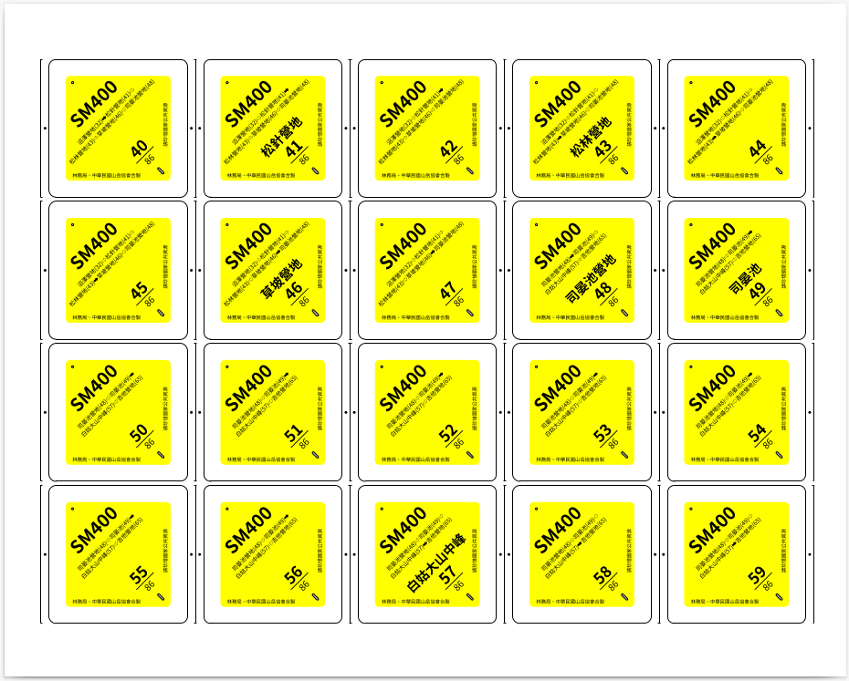

# 路標產生器


透過 CSV 資料檔及 SVG 樣版檔，大量產生出台灣目前推行的制式化山徑路標，最後合併為 PDF 檔案。產生出之 SVG 格式檔案可委由[科邁銘板](https://www.comaxglobal.com/zh/)進行生產，生產製具使用權請洽[桃園市山岳協會](https://www.tytaaa.org.tw/)。

## 源起

本專案源於[中華民國山岳協會](http://www.mountaineering.org.tw/)於2021年底施作[白姑大山路標](https://dongshih.forest.gov.tw/all-news/0068637)，為提升效率並有利於未來推廣，因此啟動此專案。

## 系統需求

- 作業系統: Ubuntu 20.04 LTS
- 命令列工具:
  - ruby
  - inkscape
  - pdfunite
  - gs

## 使用方式 (以白姑大山路標為例)

白姑大山路標分為 **編碼路標** 及 **空白路標** 兩部份，其設定檔位置如下：

- 編碼路標: `白姑大山/milestone.yaml`
- 空白路標: `白姑大山/blank.yaml`

在命令列下執行以下指令即可產生路標SVG檔案：

```shell
ruby generate.rb <設定檔路徑>
```

產出之檔案會存放在 `output/` 資料夾之下，中繼檔案會暫存於 `output/intermediate/` 內。產出之檔案主要有三個部份：

- `xxxx_RGB.pdf`: RGB 色彩空間的 PDF
- `xxxx_CMYK.pdf`: CMYK 色彩空間的 PDF
- `xxxx.zip`: 中繼檔案，包括單頁的 PDF 及個別的 SVG

## YAML 設定檔說明

```
input:
  template: 樣版檔 SVG
  data: 資料檔 CSV
  mask: 遮罩檔 SVG (標示要切割反光材質的區域)
output:
  dir: 輸出資料夾
  prefix: 輸出檔名前綴字
  w: PDF頁寬(mm)
  h: PDF頁高(mm)
  slot:
    x: 路標印製起始點X座標(mm)
    y: 路標印製起始點Y座標(mm)
    w: 路標寬度(mm)
    h: 路標高度(mm)
    repeat:
      x: X軸路標數量
      y: Y軸路標數量
```

### CSV 資料檔


資料檔的第一列為資料名稱，程式會從第二列開始在 SVG 樣版檔中尋找資料名稱，並取代為資料內容，最後產生出 SVG 檔。

### SVG 樣版檔

樣版檔可使用 Inkscape 編輯並修改，請留意文字大小及文字框位置，以免文字超出範圍。輸出前請隱藏外框及釘孔，以免製具誤差造成的問題。白姑大山路標樣版檔中，外框及釘孔均在其專用圖層中，可直接控制圖層來隱藏或顯示。

| 輸出用(隱藏外框及釘孔) | 預覽用(顯示外框及釘孔)  |
| ---  | --- |
|  |  |

### PDF 輸出檔

程式最後會產生出多頁如以下內容的 PDF 檔，送印前請務必再次人工確認：



## 已知限制

- SVG 原生僅支援 RGB，即使將最後將 PDF 轉為 CMYK 也無法產生如 Y100 或 K100 等顏色。但以路標的需求來說，並不會有太大的問題。
